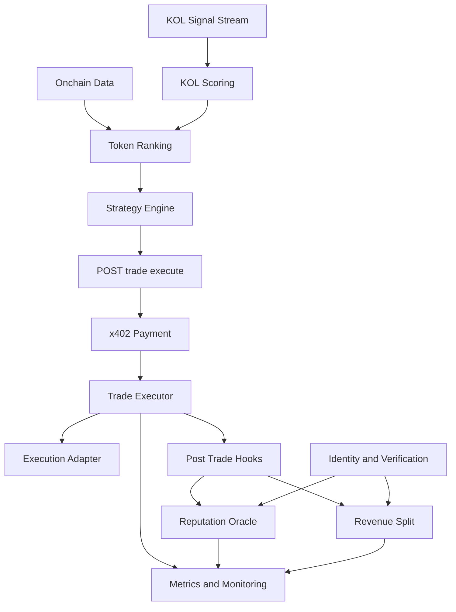

<p align="center">
  
</p>

<h1 align="center">N3ro</h1>

<p align="center">
  AI trading agent stack with ERC-8004 identity and x402 pay-per-trade gateway.
</p>

<p  align="center">
    <a href="">Documentation</a> •
    <a href="https://x.com/n3ro_agents">X (Twitter)</a> •
    <a href="">Telegram</a> •
    <a href="">Discord</a>
</p>

## Overview

N3ro is an AI trading agent built to judge KOL insights, uncover alpha tokens, and execute trades using specialized skills for optimized profit.

This monorepo ships a full protocol + backend stack:

- EVM smart contracts (identity, verification, reputation oracle, revenue split)
- Solana Anchor contracts mirroring core protocol logic
- Node.js backend with x402 payment rails and onchain post-trade hooks

## How N3ro Works

1. N3ro scans X continuously for contract addresses mentioned by 20,000+ crypto KOLs, then dynamically scores each KOL by live and historical shill quality.
2. For each detected contract, N3ro evaluates X activity quality: follower composition, active mentioners, mention volume, and engagement momentum.
3. N3ro analyzes full onchain token context: contract risk, liquidity, market cap, smart-holder footprint, creator history, and developer actions.
4. With specialized degen trading skills, N3ro converts validated signals into high-probability entries and precise exits to maximize profit efficiency.

## Skills

| Skill                    | Description                               | Frequency       |
| ------------------------ | ----------------------------------------- | --------------- |
| **Token Discovery**      | Token discovery and initial purchase      | Every 5 minutes |
| **Portfolio Monitoring** | Portfolio PnL monitoring and partial sell | Every 5 minutes |
| **Emergency Protection** | Emergency portfolio protection            | Every 5 minutes |
| **Growth Tracking**      | Token tracking and growth-based purchase  | Every 5 minutes |

## Architecture Flow



<br />
<br />

1. Signals are collected from X and combined with onchain data to build ranked opportunities.
2. Strategy engine produces trade decisions and sends them to `POST /trade/execute`.
3. Backend enforces x402 payment before execution.
4. Trade is executed via chain-specific adapters.
5. Post-trade hooks submit reputation signals and distribute revenue onchain.
6. Identity + verification state is shared across scoring and revenue pipelines.
7. All outputs feed monitoring for reliability and performance tracking.

## Monorepo Layout

```text
n3ro/
├── contracts/         # Hardhat EVM contracts
├── contracts-solana/  # Anchor Solana contracts
├── src/               # Node.js backend + x402
└── images/            # Branding assets
```

## Protocol Components

### EVM contracts (`contracts/`)

- `IdentityRegistry` (ERC-8004): agent identity + wallet binding.
- `AgentVerificationHub`: operator approval / verification status.
- `AgentReputationOracle`: signal + score submission and reputation stats.
- `RevenueSplitHub`: USDC settlement distribution with idempotent trade reference.

### Solana contracts (`contracts-solana/`)

- Anchor implementation mirroring identity, verification, reputation, and revenue split logic.
- Modularized instruction/state/context layout for maintainability.

### Backend (`src/`)

- x402 multi-rail payment middleware (EVM + Solana).
- Trade execution endpoint with post-trade hooks:
- Onchain revenue distribution.
- Onchain signal submission.
- Chain-aware runtime for both EVM and Solana.

## Quick Start

### EVM contracts

```bash
cd contracts
npm install
npm run build
npm run deploy:local
```

### Backend

```bash
npm install
cp .env.example .env
npm run dev
```

## Payment and Hook Configuration

### x402 rails

- Primary rail: `X402_NETWORK`, `PAY_TO`, `PAYMENT_ASSET`, `PRICE_PER_TRADE`.
- Optional secondary rail: `X402_NETWORK_SECONDARY`, `PAY_TO_SECONDARY`, `PAYMENT_ASSET_SECONDARY`, `PRICE_PER_TRADE_SECONDARY`.
- `eip155:*` networks use EVM hex addresses; `solana:*` networks use base58 addresses.

### Onchain hooks

- Revenue distribution: `DISTRIBUTE_ONCHAIN=true` + `DISTRIBUTION_CHAIN=evm|solana`.
- Signal submission: `SUBMIT_SIGNAL_ONCHAIN=true` + `SIGNAL_CHAIN=evm|solana`.
- EVM distribution requires `SPLIT_HUB_ADDRESS`, `OPERATOR_PRIVATE_KEY`, `REVENUE_SETTLEMENT_TOKEN`.
- Solana distribution requires `DISTRIBUTION_SOLANA_PROGRAM_ID`, `DISTRIBUTION_SOLANA_OPERATOR_SECRET_KEY`.
- Solana signal requires `SIGNAL_SOLANA_PROGRAM_ID`, `SIGNAL_SOLANA_SIGNALER_SECRET_KEY`.

## Trade API

`POST /trade/execute`

### EVM sample payload

```json
{
  "agentId": 1,
  "tradeId": "trade-evm-0001",
  "result": {
    "status": "EXECUTED",
    "pnlBps": 120
  },
  "resultHash": "0xaaaaaaaaaaaaaaaaaaaaaaaaaaaaaaaaaaaaaaaaaaaaaaaaaaaaaaaaaaaaaaaa"
}
```

### Solana sample payload

```json
{
  "agentId": "7",
  "tradeId": "trade-solana-0007",
  "resultHash": "0xbbbbbbbbbbbbbbbbbbbbbbbbbbbbbbbbbbbbbbbbbbbbbbbbbbbbbbbbbbbbbbbb",
  "contextHash": "0xcccccccccccccccccccccccccccccccccccccccccccccccccccccccccccccccc",
  "riskFlags": 3,
  "solanaAgentTokenAccount": "4vJ9JU1bJJE96FWSJxSgVn6fBrWQ4wYv5hNnXhZ6b2qA"
}
```

## Notes

- Revenue distribution is idempotent by trade reference hash to prevent double payout on retries.
- Backend supports optional `contextHash`, `riskFlags`, and `solanaAgentTokenAccount` for richer Solana signal/distribution flows.
